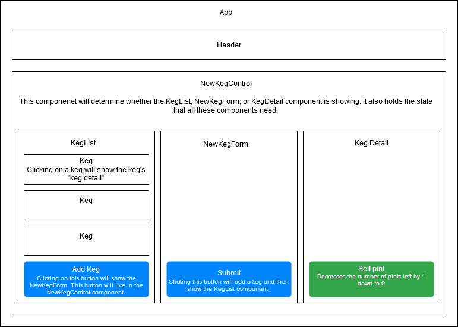

# _Tap Room_
#### _React with Reduxproject for Epicodus, 2020.09.11_
#### By _**Sara Kane**_

## Description
Keg inventory tracker for a bar using React with Redux.

## Specifications

* As a user, I want to see a list/menu of all available kegs. For each keg, I want to see its name, brand, price and alcoholContent (or perhaps something like flavor for a kombucha store).
* As a user, I want to submit a form to add a new keg to a list.
* As a user, I want to be able to click on a keg to see its detail page.
* As a user, I want to see how many pints are left in a keg. Hint: A full keg has roughly 124 pints.
* As a user, I want to be able to click a button next to a keg whenever I sell a pint of it. This should decrease the number of pints left by 1. Pints should not be able to go below 0.
* As a user, I want a keg to update to say "Out of Stock" once it's empty.

### Component Diagram

## Setup/Installation

### Required software:
* [NodeJs](https://nodejs.org/en/) is required to run the project 

### Download Repo
* Clone this GitHub repository by running `git clone https://github.com/sarakane/tap-room-redux.git` in the terminal.
  * Or download the ZIP file by clicking on `Code` then `Download ZIP` from this repository.

### Setup locally
* Navigate into the new "tap-room" folder
* Once inside the "tap-room" directory run `npm install` to install all of the necessary dependencies.

### Available Scripts

In the project directory, you can run:

#### `npm start`

Runs the app in the development mode. 
Open [http://localhost:3000](http://localhost:3000) to view it in the browser.

The page will reload if you make edits. 
You will also see any lint errors in the console.

#### `npm test` 
Launches the test runner in the interactive watch mode. 
See the section about [running tests](https://facebook.github.io/create-react-app/docs/running-tests) for more information.

## Known Bugs

* No known bugs.

## Technologies Used

* React
* Redux
* HTML
* CSS
* JavaScript
* Jest
* NPM
* Webpack
* Git

### License

*This site is licensed under the MIT license.*

Copyright (c) 2020 **_Sara Kane_**
